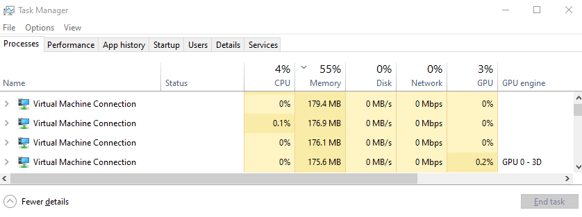

[](https://discord.gg/D5QTtWEwxZ) 

> Ping me if you need help setting up the environment or adding new features.


# 1. Capsulecorp AD Pentest (Hyper-v)

The Capsulecorp AD Pentest is a small virtual network created using Vagrant and Ansible on Hyper-V. It contains several Windows machines configured with various vulnerabilities, a Windows Development machine, a Kali machine, and a KMS server. This project can be used to learn network [Active Directory penetration testing](https://the-pentesting-guide.marmeus.com/?q=Active+Directory)  (I have created [a small AD hacking path](./WRITEUP.md)), test C2 programs, and develop software for future Active Directory Audits or bypass AVs.

This project took inspiration from [Royce](https://twitter.com/r3dy__)'s repo [capsulecorp-pentest](https://github.com/R3dy/capsulecorp-pentest) and wanted to adapt it to an Active Directory environment using the power of Windows Hyper-V.

## Why is this cool?
Nowadays, there is no free platform where you can interact with a vulnerable Active Directory environment unless you have a beefy computer with a huge amount of RAM and CPU. Thankfully, Hyper-V solves all these problems allowing you to have an AD environment consuming very few resources.




Plus, the performance is quite impressive for Linux and Windows systems, giving the same ammount of CPU cores and RAM.

### Linux


### Windows


# Requirements

- A Windows system with at least 8GB of RAM and Windows Hyper-V capabilities.

# What is inside?

If you install the whole lab environment you will encounter 8 machines each one created for a different purpose:

- **KMS** (192.168.56.2): KMS server used to activate the Windows Workstations, Windows Servers and Microsoft Office.
- **Development** (192.168.56.3): A Windows Workstation (Not in the domain) with Visual Studio y Visual Studio Code in order to develop software for C2.
- **Kali** (192.168.56.4): Kali machine with Samba and Apache to store and deliver the software created on the development machine.

> :warning: If you want to perform `dist-upgrade` or `upgrade` on the Kali (pentest) machine, it might break the enhanced hyper-v session or even brake the GUI, so to recover those features, there is a script at `/home/auditor/install_xrdp.sh`, that you only need to do `chmod +x install_xrdp.sh; sudo ./install_xrdp.sh; sudo reboot` in order to fix everything, hopefully. :sweat_smile:

- **Goku** (192.168.56.5): Domain Controller with several vulnerabilities from [vulnerable-AD-plus](https://github.com/WaterExecution/vulnerable-AD-plus).
- **Krillin** (192.168.56.6): Windows Server with Microsoft Office and a vulnerable service to escalate privileges and move laterally. This is the starting point of the hacking lab as the user "auditor".
- **Raditz** (192.168.56.7): Windows Server with an ISS Web Server vulnerable to Unconstrained delegation.
- **Gohan** (192.168.56.8): Windows Server with an MSSQL Server Vulnerable to Constrained Delegation.
- **Tein** (192.168.56.9): A Windows Workstation in the domain with Office to perform phishing attacks or enumerate the domain.

In each machine, there are some users in order to access the machine through Remote Desktop except KMS which is through SSH.

- **KMS**: 

```bash
vagrant:vagrant
```

- **Development**: 

```bash
# Administrator
.\auditor:PassW0rd
```

- **Kali**:

```bash
# Administrator
auditor:PassW0rd
```

- Goku:

```bash
# Domain Admin
Administrator:PassW0rd432!
```

- **Krillin**:

```bash
# User (Not in the domain)
auditor:PassW0rd
# Local Administrator (Domain User)
vuln_svc:PassW0rd@SVC
```

- **Raditz**:

```bash
# Local Administrator (Domain User)
iis_svc:p@$$w0rd
```

- **Gohan**:

```bash
# Local Administrator (Domain User)
sql_svc:PassW0rd@MSSQL
```

- **Tien**:

```bash
# Local Administrator (Domain User)
employee1:PassW0rd!
```

## Active Directory Vulnerabilities

In the lab environment you will encounter the following vulnerablities:

- Vulnerable Service

- Unconstrained delegation

- Constrained delegation

- Abusing ACLs/ACEs

- Kerberoasting

- AS-REP Roasting

- Abuse DnsAdmins

- Password in an AD User comment

- Password Spraying

- DCSync

- Silver Ticket

- Golden Ticket 

- Pass-the-Hash 

- Pass-the-Ticket

- SMB Signing Disabled

- Bad WinRM permission

- Anonymous LDAP query

- Public SMB Share

# Installation

The installation process can be followed in the [INSTALLATION](./INSTALLATION.md) file.

# References

- [Original Repo](https://github.com/R3dy/capsulecorp-pentest/tree/master/roles)
- [The Pentesting Guide](https://the-pentesting-guide.marmeus.com/)
